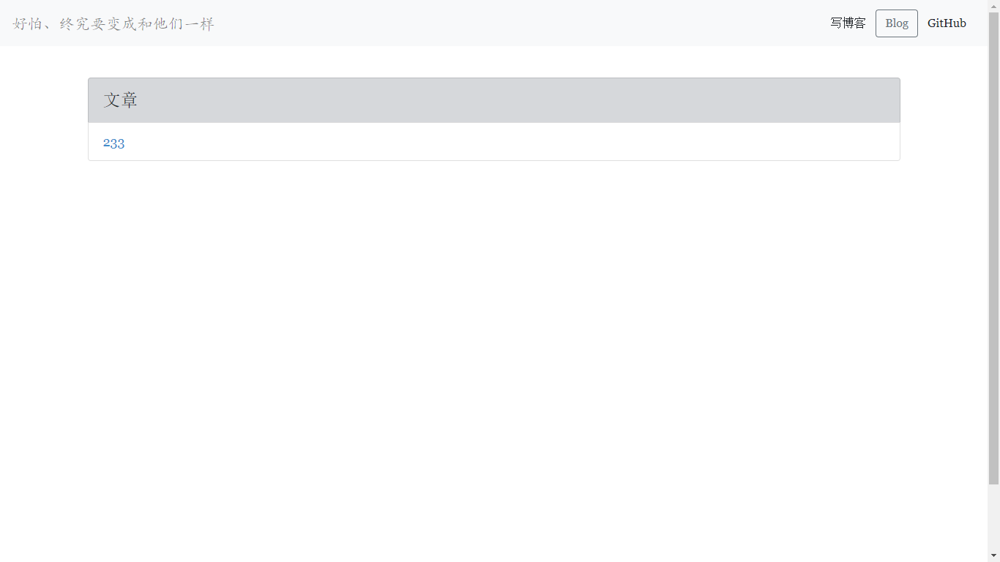
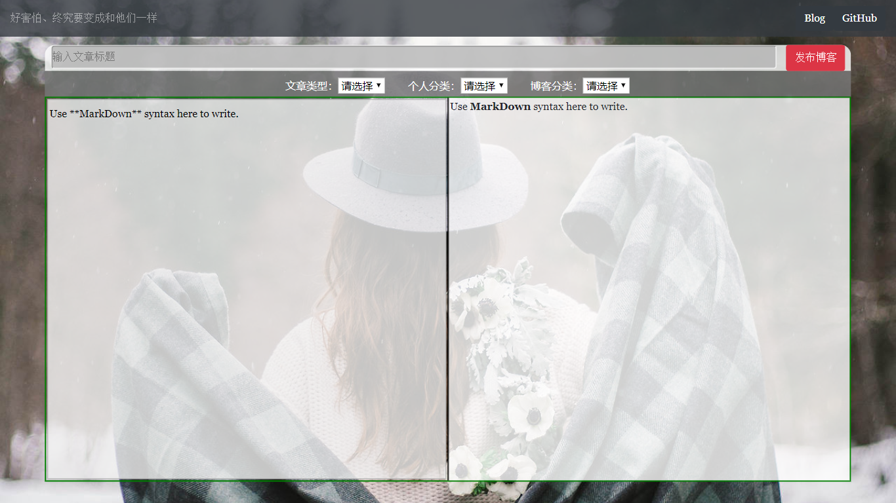
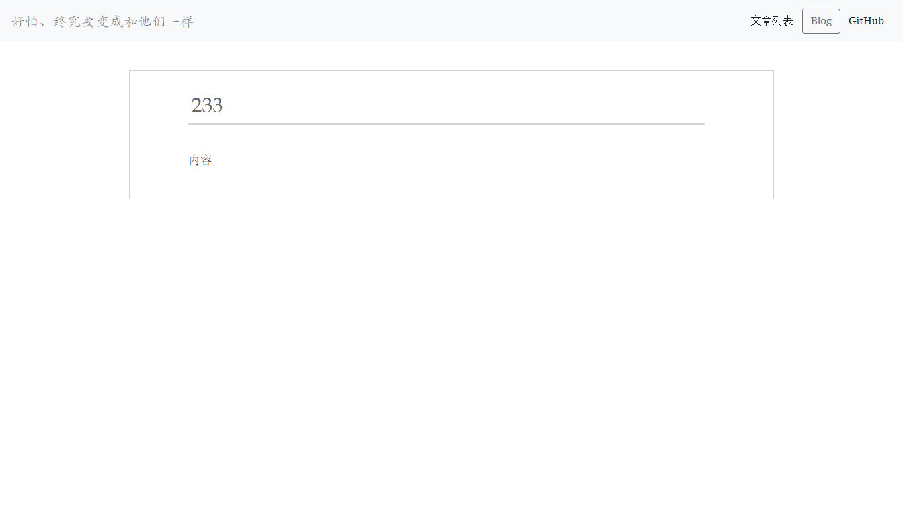

## **jdbc_mysql**这是servlet学习时的建立个人博客想法

使用了**jsp、servlet、mysql**
以及网上找来的markdown.js插件(很弱)

哦对了，我还用了前端框架**bootstrap**，，哈哈，用bootstrap的jsp，简直丧心病狂~
首页仿自[阮一峰](http://www.ruanyifeng.com/home.html){_target}，文章列表和详情页仿自[王银](http://www.yinwang.org){_target}

**很多东西未完善(比如，filter,listener等都没放进去)，已经搁置**

## 以下是项目效果图：

    

    

    

    

## 使用方法

- 将jdbc_mysql clone到ide中，加入tomcat运行即可
- 注意运行时浏览器要写index.jsp，index.html是github要求添加的(..)
